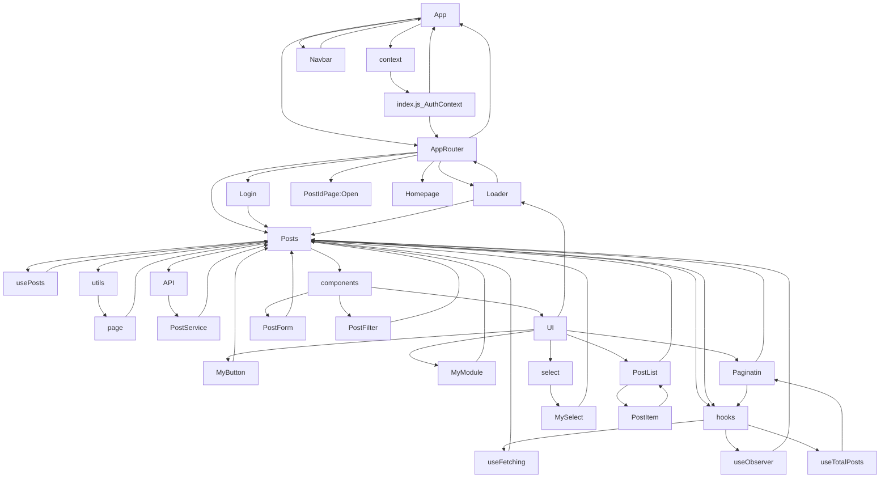
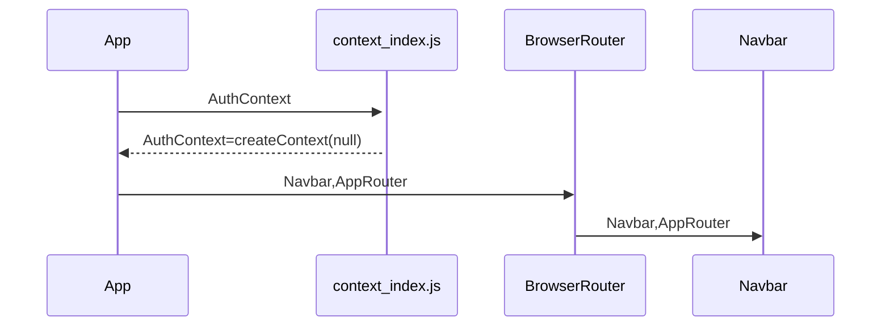
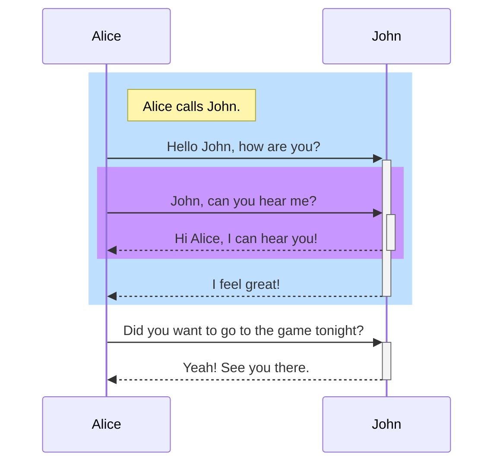

### A note for beginners in creating a react application/
### Пометка для начинающих в создание react приложения.

## Getting Started with Create React App

## npm install 
Понимание того, что такое Node.js поможет вам лучше разобраться с npm. В двух словах — Node.js это интерпретатор языка JavaScript. Сам по себе Node.js является C++ приложением, которое получает на входе JavaScript-код и выполняет его. (https://habr.com/ru/post/243335/)

Этот проект был загружен с помощью [Create React App]/
This project was bootstrapped with [Create React App](https://github.com/facebook/create-react-app).

Ссылка на видеокур по React Js:https://youtu.be/GNrdg3PzpJQ?list=PL6DxKON1uLOFJ5_dDcX7G1osKnsBlCaaT (Я не являюсь автором курса/I am not the author of the course/)

### useState() = https://reactjs.org/docs/hooks-state.html / https://www.w3schools.com/react/react_usestate.asp

Первое значение count— это наше текущее состояние./ The first value of count is our current state.
Второе значение — setCount функция, которая используется для обновления нашего состояния./ The second value is the setCount function, which is used to update our state.

``` import React, { useState } from 'react';

   function Example() {
     const [count, setCount] = useState(0);

      return (
        <div>
             <p>You clicked {count} times</p>
                <button onClick={() => setCount(count + 1)}>
                  Click me
                </button>
         </div>);}
```
### useEffect() = https://www.w3schools.com/react/react_useeffect.asp
Хук useEffect позволяет вам выполнять побочные эффекты в ваших компонентах.
Некоторые примеры побочных эффектов: выборка данных, непосредственное обновление DOM и таймеры.
useEffect принимает два аргумента. Второй аргумент является необязательным. Если оставить пустую зависимость функция повторяться, Если поставить [] рендеринг будет происхродить 1 раз происходить только один раз.(При изменении зависимости [dependence] происходит повторный ренндер <function>).

useEffect (function, dependency)
   
Хук useEffect построен таким образом, что мы можем вернуть функцию внутри него, и именно в этой функции возврата происходит очистка. Функция очистки предотвращает утечку памяти и устраняет некоторые ненужные и нежелательные действия.
   https://daily-dev-tips.com/posts/react-useeffect-cleanup/
   
   Пример отчистки таймера: 
```    import { useState, useEffect } from "react";
import ReactDOM from "react-dom/client";

function Timer() {
  const [count, setCount] = useState(0);

  useEffect(() => {
    let timer = setTimeout(() => {
    setCount((count) => count + 1);
  }, 1000);

  return () => clearTimeout(timer)
  }, []);

  return <h1>I've rendered {count} times!</h1>;
}

const root = ReactDOM.createRoot(document.getElementById('root'));
root.render(<Timer />);
``` 
   
### useRef() =  
   useRef Используется в двух сценариях:
   1) Создание переменной которая не приводить к обновлению компонента
   По сути, useRefэто как «коробка», которая может содержать изменяемое значение в своем .currentсвойстве.
   Возможно, вы знакомы с ссылками прежде всего как со способом доступа к DOM . Если вы передадите объект ref в React с помощью <div ref={myRef} />, 
   React установит для своего .currentсвойства соответствующий узел DOM при каждом изменении этого узла.
   :
   ```function App(){
      const [counter,setCounter] = useState(0)
      
      const ref =useRef();
      useEffect(()=>{
         ref,current={
            counter:0,
        };
      },[])
      
      return (
         <div>
         <button onClicl={()=> ref.current.counter++}>
            Нажали {counter} раз.
         </button>
         <br/>
         <button onClick={()=>setCounter(ref.current.counter++)}>
            Обновить
         </button>
         </div>
         );
   }
```
   2) Когда необходимо создать ссылку на элемент компонента и соответсвенно как пример реализации отслеживания элемента.
   https://www.youtube.com/watch?v=Zn54xUCkh9s
   
### useMemo() =
   
   Чтобы кэшировать вычисление между повторными рендерингами, оберните его useMemoвызовом на верхнем уровне вашего компонента.
   При первоначальном рендеринге значение , которое вы получите useMemo, будет результатом вызова вашего вычисления .
   При каждом последующем рендеринге React будет сравнивать зависимости с зависимостями, которые вы передали во время последнего рендеринга. Если ни одна из зависимостей не изменилась (по сравнению с Object.is), useMemoвернет значение, которое вы уже вычислили ранее. В противном случае React повторно запустит ваш расчет и вернет новое значение.
   https://beta.reactjs.org/apis/react/useMemo
```
   import { useMemo } from 'react';

   function TodoList({ todos, tab, theme }) {
   const visibleTodos = useMemo(() => filterTodos(todos, tab), [todos, tab]);
}
   ```

### useCallback() =
   
   Это позволяет нам изолировать ресурсоемкие функции, чтобы они не запускались автоматически при каждом рендеринге.

Хук useCallbackзапускается только при обновлении одной из его зависимостей.

Это может улучшить производительность.

Крючки useCallbackи useMemoпохожи. Основное отличие состоит в том, что useMemoвозвращает запомненное значение и useCallbackвозвращает запомненную функцию . Вы можете узнать больше о useMemo в главе useMemo.
```
   import React, { useCallback } from 'react';
function MyComponent() {
  const handleClick = useCallback(() => {
    // handle the click event
  }, []);
  return <MyChild onClick={handleClick} />;
}
```
### useContext() =

## Available Scripts
In the project directory, you can run:

### `npm start`
Runs the app in the development mode.\
Open [http://localhost:3000](http://localhost:3000) to view it in your browser.
The page will reload when you make changes.\
You may also see any lint errors in the console.

### `npm test`
Launches the test runner in the interactive watch mode.\
See the section about [running tests](https://facebook.github.io/create-react-app/docs/running-tests) for more information.

### `npm run build`
Builds the app for production to the `build` folder.\
It correctly bundles React in production mode and optimizes the build for the best performance.
The build is minified and the filenames include the hashes.\
Your app is ready to be deployed!

See the section about [deployment](https://facebook.github.io/create-react-app/docs/deployment) for more information.

### `npm run eject`
**Note: this is a one-way operation. Once you `eject`, you can't go back!**

If you aren't satisfied with the build tool and configuration choices, you can `eject` at any time. This command will remove the single build dependency from your project.
Instead, it will copy all the configuration files and the transitive dependencies (webpack, Babel, ESLint, etc) right into your project so you have full control over them. All of the commands except `eject` will still work, but they will point to the copied scripts so you can tweak them. At this point you're on your own.
You don't have to ever use `eject`. The curated feature set is suitable for small and middle deployments, and you shouldn't feel obligated to use this feature. However we understand that this tool wouldn't be useful if you couldn't customize it when you are ready for it.

## Learn More
You can learn more in the [Create React App documentation](https://facebook.github.io/create-react-app/docs/getting-started).
To learn React, check out the [React documentation](https://reactjs.org/).

### Code Splitting
This section has moved here: [https://facebook.github.io/create-react-app/docs/code-splitting](https://facebook.github.io/create-react-app/docs/code-splitting)

### Analyzing the Bundle Size
This section has moved here: [https://facebook.github.io/create-react-app/docs/analyzing-the-bundle-size](https://facebook.github.io/create-react-app/docs/analyzing-the-bundle-size)

### Making a Progressive Web App
This section has moved here: [https://facebook.github.io/create-react-app/docs/making-a-progressive-web-app](https://facebook.github.io/create-react-app/docs/making-a-progressive-web-app)

### Advanced Configuration
This section has moved here: [https://facebook.github.io/create-react-app/docs/advanced-configuration](https://facebook.github.io/create-react-app/docs/advanced-configuration)

### Deployment
This section has moved here: [https://facebook.github.io/create-react-app/docs/deployment](https://facebook.github.io/create-react-app/docs/deployment)

### rsc - быстрое развёртывание снипета для создание формы. 
   https://habr.com/ru/company/kts/blog/653283/

Component relationship diagram/Диаграмма взаимосвязей компонентов:





